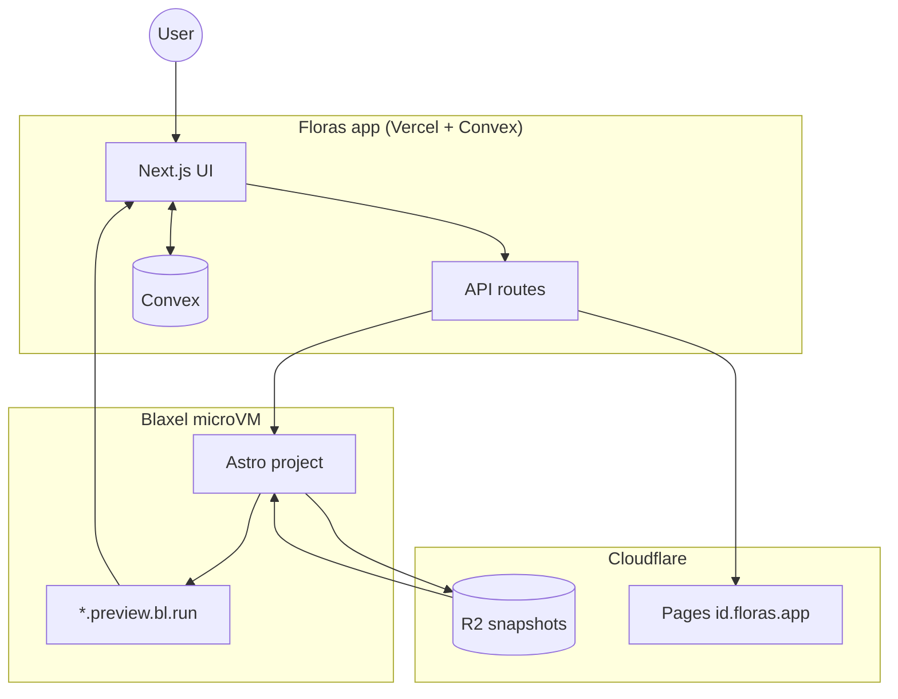
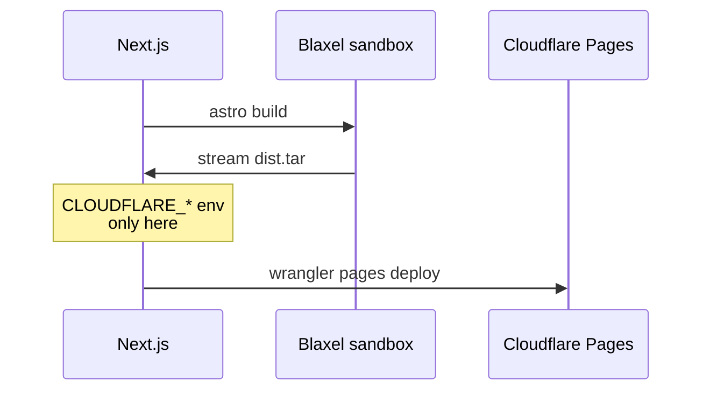

# Floras: one sentence to a real Astro site

Floras turns a plain-English prompt into a real Astro website with a live preview. On **Pro**, hosting is included — publish to `{id}.floras.app` on Cloudflare Pages, or connect your own domain.

---

## Why I built it again

Motivation for Floras came from an earlier experiment: a Lovable-like app for generating Next.js sites. This was early 2025, and the industry was still early. Tool calling was something LLMs didn’t do well. I was rate-limited by Anthropic (thanks a lot). Overall it was a big project and needed more time than I had.

I wrote about Builddrr originally in January 2025, and ever since I’ve had an itch I couldn’t scratch. So I gave it another try at the end of summer and came up with a decent product in one train ride and a busy evening.

I wanted Floras to have a fresh, clean look — fix my earlier design and architecture mistakes, and keep the whole thing simple enough to do what it’s supposed to do.

Build websites.

---

## The stack

Floras is a Next.js app with a Convex backend and database, hosted on Vercel, using Cloudflare R2 for workspace snapshots, Blaxel for pay-as-you-go microVM sandboxes, and Cloudflare Pages for published sites.

This is a familiar stack for me. A good substitute could have been Neon Postgres + Drizzle on Cloudflare Workers or Railway. I chose Convex to save time — I love it for end-to-end type safety, schemas in code in the same repo as the app, good DX, and ready-made components like `@convex-dev/r2`. Convex is also a reactive backend, so I don’t need custom revalidation logic everywhere.

Fewer services to manage. Fewer credit cards to maintain.

### How a site gets built

The flow is simple:

1. You chat with an AI SDK agent that has tools for design guidance, reading/writing files in a sandbox, and resuming the preview environment.
2. The agent stores a structured **SitePlan** (Zod) before touching files — less drift than free-form markdown dumps.
3. A template repo is cloned into the sandbox when empty; the agent edits the Astro project in place inside `floras-{projectId}`.
4. Tool activity streams into Convex; the chat and preview update reactively.
5. When the sandbox stops or generation finishes, the workspace is snapshotted to R2 as `workspace.tar.gz` and restored on the next session.

Heavy SDKs (AI, Blaxel, Autumn billing) stay in **Next.js API routes**, not Convex — partly because Convex has a module size limit and I actually hit it.

### Blaxel + R2 + Pages (the part that confuses people)

Previews run in Blaxel sandboxes: fast boot, good SDK, public preview URLs per project. I didn’t want Blaxel’s Pro plan, so I lost persistent volumes on microVMs.

**R2** holds workspace snapshots — source backups so sandboxes can come back after idle TTL. It is **not** where published sites live.

**Cloudflare Pages** hosts the static output. On publish:

1. The sandbox runs `astro build`
2. Next.js pulls the `dist` archive from the sandbox
3. Wrangler uploads it to Pages
4. Floras upserts `{id}.floras.app` → `*.pages.dev`

Cloudflare secrets never enter the VM. That’s intentional.

Astro is the right choice for client sites: efficient, light, built for static deployment, easier to run than Next.js for this use case. Client sites stay fast with zero config. Pages hosting is essentially free at this scale — a real financial edge. Sites are static on Pages; contact forms are client-side `fetch()` calls to Floras’s backend, so there’s no server in the Astro deploy itself.

### Billing

Billing runs through **Autumn** (`autumn-js` in Next.js). YC-backed, kept showing up on my X feed, and I’d wanted an excuse to try it.

**Fail-closed in production** — if billing checks fail, generation doesn’t run. Dev can fail-open so you can build without Autumn wired up.

| Plan | Price | What you get |
| --- | --- | --- |
| **BYOK** | ~$5/mo | Your Anthropic key, live preview, export (tar.gz). No platform credit metering. No hosted publish. |
| **Pro** | $20/mo | Platform AI credits, hosted publish on `{id}.floras.app`, custom domains |
| **Pro Yearly** | $192/yr | Same as Pro |

Credit top-ups available as an add-on.

---

## What keeps it from being another broken agent demo

**Structured planning first.** The agent calls `plan_site` with a Zod `SitePlan` instead of fragile free-form text that drifts after three messages. Then it boots a real project from a GitHub template and edits files in a named sandbox — not “generate a pile of markdown and pray.”

**Reactive workspace.** Tool steps and summaries stream into Convex. Chat and preview stay in sync without polling glue.

**Persistence without volumes.** Workspace → R2 snapshot → restore when the sandbox returns.

**Safe publish.** Build in sandbox, upload from Next.js, secrets stay on the host.

**Two composer modes.** **Ask** helps you figure out what to build; **Build** runs the agent.

---

## Removed: “atomic claim jobs”

I briefly had `claimGeneration` / `claimPublish` plus a `busyAt` timestamp — layered on top of `messages.send`, which already blocks new turns when a streaming assistant exists or the project is `generating` / `publishing`.

That was redundant. Generation now relies on `messages.send` + `setStatus("generating")`. Publish uses `setPublishStatus("publishing")` with a busy check in the same mutation. Stuck jobs clear via `resetBusy`; the UI shows a reset button after two minutes of continuous busy state.

---

## What I skipped (for now): testing

This is the honest part. Floras shipped fast — train ride, busy evening — and **there is no automated test suite yet**.

No unit tests. No integration tests. No Playwright e2e. No CI workflow on push. The only gate before merge today is:

```bash
pnpm typecheck
```

That’s it. TypeScript catches a lot (Convex validators, Zod schemas, typed API boundaries), but it does **not** catch:

- A broken publish flow after a Cloudflare API change
- Form CORS regressions on custom domains
- Agent tool loops that hang
- R2 snapshot restore failing silently
- Billing fail-closed edge cases

Right now I rely on manual smoke tests: generate a site, preview it, submit a form, publish, connect a domain, export. Fine for a solo v1; not fine forever.

What I’d add next, in order:

1. **Unit tests** for pure logic — `parseHostname`, `sanitizeFields`, `isProjectBusy`, billing access helpers
2. **API route tests** (Vitest + mocked Convex/Blaxel) for `/api/forms/submit`, publish, domains
3. **Convex function tests** via `convex-test` for auth, forms, turn/send concurrency
4. **One e2e path** (Playwright): sign up → create project → send prompt → see preview iframe load
5. **GitHub Actions** — `typecheck` + tests on every PR

Agent output quality is harder to test deterministically; I’d start with schema validation on `SitePlan` and snapshot tests on scaffolded file structure, not full LLM evals.

If you’re reading this as a builder: the architecture is deliberate; the test coverage is not. Yet.

---

## Already shipped (not “coming soon”)

- **Custom domains** — connect via Account → Domains or ask the agent (`setup_domain`). DNS CNAME to your Pages subdomain; status tracked in-app.
- **Contact forms** — generated sites POST to Floras `/api/forms/submit`. Submissions land in a dashboard inbox; email notifications via Cloudflare Email Sending.
- **Export** — download the full Astro project as tar.gz (BYOK and Pro).

---

## Design / UX

Composition-first UI: `MarketingLayout`, `DashboardShell`, shared site components. Chat uses AI SDK Elements so generation feels like a conversation with visible tool progress. Dark, locked app theme. The preview is the hero of the workspace — not an afterthought in a sidebar.

Auth: Convex Auth with password and Google OAuth.

---

## Technical decisions that matter

| Decision | Why it matters |
| --- | --- |
| Astro as output | Fast static sites, clean code, good for marketing sites |
| Blaxel sandboxes | Real runtime + public preview URL per project |
| Convex reactivity | Chat and preview stay in sync with minimal custom realtime code |
| Zod SitePlan | Structured plan before edits; less drift in the planning phase |
| R2 snapshots | Persist work without Blaxel volumes |
| Publish from Next.js, not the VM | Secrets never leak into generated sites or sandboxes |
| Forms on Floras API | Static Pages deploy + working contact forms without a site backend |

---

## Security / trust

- Preview URLs are public — treat them like share links.
- Owner-only writes via `authedMutation`.
- Sandbox names are validated to the project (`floras-{projectId}`).
- No Cloudflare, email, or Anthropic secrets injected into user sites.

---

## What’s next

- **Tests + CI** — see above; highest priority before calling this “production-grade”
- Higher bar on generated site design — brand kits, design systems, less “AI slop”
- Richer iteration without killing the one-prompt speed
- More templates and section patterns for specific industries
- Open source — repo license still needs alignment (`package.json` says MIT; `LICENSE` is AGPL v3 today)

---

## Close

One sentence → live site → ship.

Try Floras. Follow the build.

---

## Architecture illustrations

Full diagram set (10 figures: overview, stack, generation, publish, R2 vs Pages, trust boundary, forms, billing, ASCII fallback):

**[`floras-architecture-diagrams.md`](./floras-architecture-diagrams.md)**

Quick picks for a short post:

### System overview



### Publish path (why secrets never enter the sandbox)



```text
Prompt → messages.send → /api/generate → agent + SitePlan
                ↓                              ↓
           Convex (reactive UI)         Blaxel (astro dev)
                ↓                              ↓
           preview iframe          R2 snapshot (source only)
                                           ↓
                              publish: dist → Next.js → Pages
```
