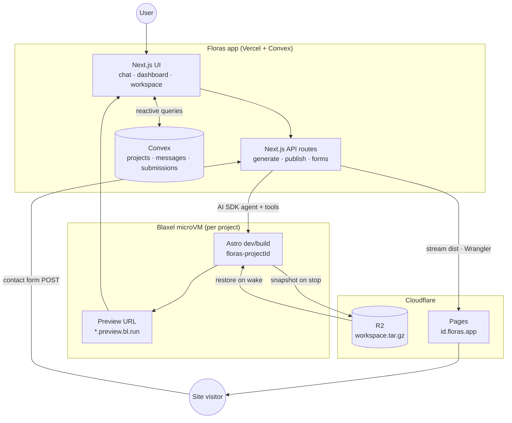
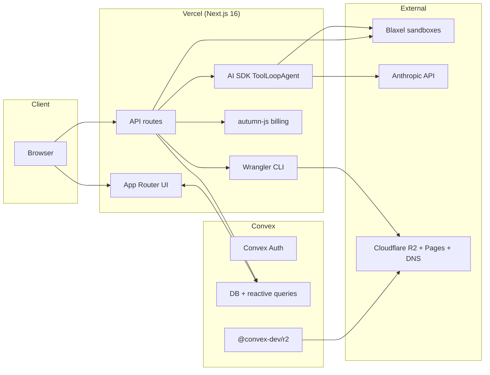
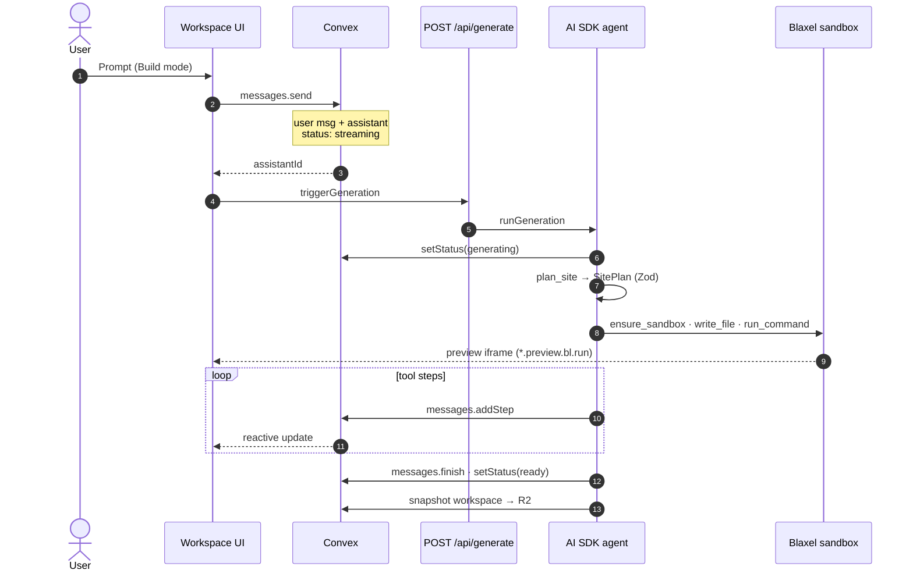
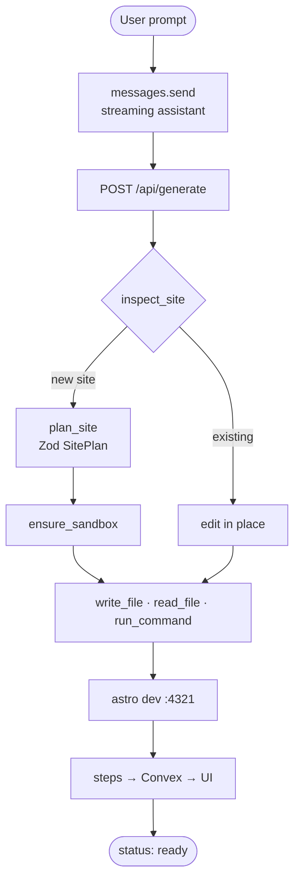
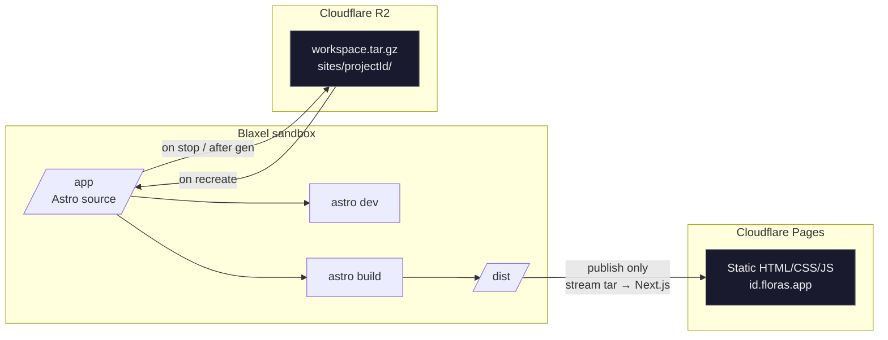
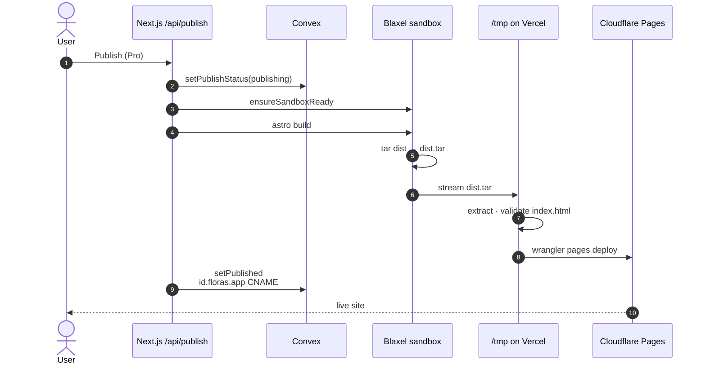
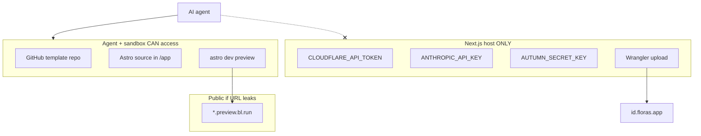
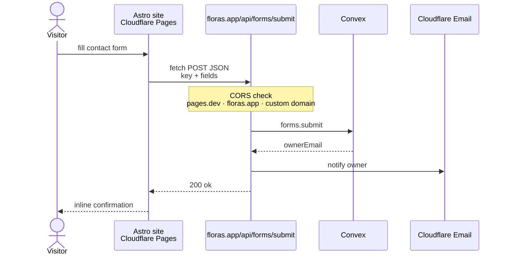
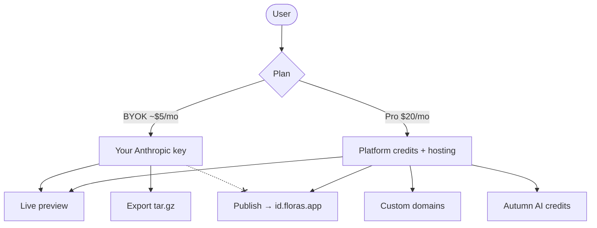

# Floras — architecture illustrations

Copy any diagram block into your markdown post. Renders on GitHub, GitLab, Notion (mermaid block), and most static site generators with Mermaid enabled.

---

## 1. System overview

Three planes: **Floras app** (you control), **sandboxes** (agent edits here), **published sites** (static output).



---

## 2. Stack layers

What runs where — and what deliberately does **not** live in Convex.



---

## 3. Generation flow (chat → live preview)

The streaming assistant row from `messages.send` is the turn lock — no separate claim job.



---

## 4. Agent tool loop (inside the sandbox)



---

## 5. Sandbox persistence (R2 vs volumes)

Blaxel free tier has no volumes. R2 holds **source**, not the published site.



---

## 6. Publish flow (secrets stay out of the VM)

Cloudflare tokens live in Next.js env only. The agent never sees them.



---

## 7. Trust boundary (what the agent can touch)



---

## 8. Contact forms on static Pages sites

Published Astro sites have no backend. Forms POST cross-origin to Floras.



---

## 9. Billing lanes (BYOK vs Pro)



---

## 10. One-page cheat sheet (ASCII)

For platforms without Mermaid rendering:

```text
┌─────────────────────────────────────────────────────────────────┐
│  FLORAS APP (Vercel)          CONVEX (reactive DB)              │
│  ┌──────────┐  ┌─────────────┐  projects · messages · forms    │
│  │ Chat UI  │◄─┤ queries     │                                 │
│  └────┬─────┘  └─────────────┘                                 │
│       │         ┌─────────────┐                                 │
│       └────────►│ API routes  │──► Autumn billing               │
│                 │ generate    │──► AI SDK agent                   │
│                 │ publish     │──► Wrangler → CF Pages          │
│                 │ forms       │                                 │
└─────────────────┼─────────────┼─────────────────────────────────┘
                  │             │
                  ▼             ▼
         ┌────────────┐   ┌──────────┐
         │ BLAXEL VM  │   │ CF R2    │  workspace.tar.gz (source)
         │ Astro /app │──►│ snapshot │  NOT published HTML
         │ :4321 prev │   └──────────┘
         └─────┬──────┘
               │ astro build → dist streamed out
               ▼
         ┌────────────┐
         │ CF PAGES   │  id.floras.app (Pro)
         └────────────┘
```

---

## Usage tips

- **GitHub / GitLab:** paste mermaid blocks as-is in `.md` files.
- **Blog without Mermaid:** use diagram **#10 (ASCII)** or export PNG from [mermaid.live](https://mermaid.live).
- **Short post:** diagrams **#1**, **#5**, and **#6** cover the confusing parts (R2 vs Pages, publish path).
